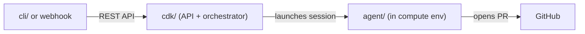

# Developer guide

This project is built in TypeScript with [Yarn workspaces](https://classic.yarnpkg.com/lang/en/docs/workspaces/), [mise](https://mise.jdx.dev/) for tasks and tool versions, and AWS CDK for infrastructure. There is project-wide testing, code checks, and compilation. There is currently no dedicated development container, so you need to configure your local development environment by following the steps below.


The repository is organized around four main pieces:

- **Agent runtime code** in Python under `agent/`  - runtime entrypoint, task execution loop, memory writes, observability hooks, and local container tooling.
- **Infrastructure as code** in AWS CDK under `cdk/src/`  - stacks, constructs, and handlers that define and deploy the platform on AWS.
- **Documentation site** under `docs/`  - source guides/design docs plus the generated Astro/Starlight documentation site.
- **CLI package** under `cli/`  - the `bgagent` command-line client used to authenticate, submit tasks, and inspect task status/events.
- **Claude Code plugin** under `docs/abca-plugin/`  - a [Claude Code plugin](https://docs.anthropic.com/en/docs/claude-code/plugins) with guided skills and agents for setup, deployment, task submission, and troubleshooting. See the [plugin README](../abca-plugin/README.md) for details.

> **Tip:** If you use Claude Code, run `claude --plugin-dir docs/abca-plugin` from the repo root. The plugin's `/setup` skill walks you through the entire setup process interactively.

## Where to make changes

Before editing, decide which part of the monorepo owns the behavior. This keeps API types, CLI, and docs in sync.

| Area | Paths | Notes |
|------|--------|--------|
| API & Lambdas | `cdk/src/handlers/`, `cdk/src/stacks/`, `cdk/src/constructs/` | Extend `cdk/test/` for the same feature. |
| API types | `cdk/src/handlers/shared/types.ts` and **`cli/src/types.ts`** | Update both when request/response shapes change. |
| CLI | `cli/src/`, `cli/test/` |  - |
| Agent runtime | `agent/` | Bundled into the image CDK deploys; run `mise run quality` in `agent/` or root build. |
| Docs (source) | `docs/guides/`, `docs/design/` | After edits, run **`mise //docs:sync`** or **`mise //docs:build`**. Do not edit `docs/src/content/docs/` directly. |

For a concise duplicate of this table, common pitfalls, and a CDK test file map, see **[AGENTS.md](../../AGENTS.md)** at the repo root (oriented toward automation-assisted contributors). Package-specific detail lives in **`AGENTS.md`** under `cdk/`, `cli/`, `agent/`, and `docs/`.

## Repository preparation

The [Quick Start](./QUICK_START.mdx) covers the basic setup: forking a sample repo, creating a PAT, registering a Blueprint, and storing the token in Secrets Manager. This section covers what you need beyond that.

### Pre-flight checks

After deployment, the orchestrator calls the GitHub API before starting each task to verify your token has enough privilege. This catches common mistakes (like a read-only PAT) before compute is consumed. If the check fails, the task transitions to `FAILED` with a clear reason like `INSUFFICIENT_GITHUB_REPO_PERMISSIONS` instead of failing deep inside the agent run.

Permission requirements vary by task type:

- `new_task` and `pr_iteration` require Contents (read/write) and Pull requests (read/write).
- `pr_review` only needs Triage or higher since it does not push branches.

Classic PATs with `repo` + `read:org` scopes also work and are required when fine-grained tokens cannot reach the target repo (collaborator access, cross-org repos). See [agent/README.md](../../agent/README.md#github-pat--minimal-permissions) for when to use which token type.

### Quick setup (single repo)

To point the default Blueprint at your own repo without editing code, pass it as a CDK context variable or environment variable:

```bash
# Context variable (preferred)
MISE_EXPERIMENTAL=1 mise //cdk:deploy -- -c blueprintRepo=your-org/your-repo

# Or environment variable
BLUEPRINT_REPO=your-org/your-repo MISE_EXPERIMENTAL=1 mise //cdk:deploy
```

The default is `awslabs/agent-plugins`. For a quick end-to-end test, fork that repo and pass your fork (e.g. `-c blueprintRepo=jane-doe/agent-plugins`).

### Multiple repositories

To onboard additional repositories, add more `Blueprint` constructs in `cdk/src/stacks/agent.ts` and append them to the `blueprints` array (used to aggregate DNS egress allowlists):

```typescript
new Blueprint(this, 'MyServiceBlueprint', {
  repo: 'acme/my-service',
  repoTable: repoTable.table,
});
```

Each Blueprint supports per-repo overrides grouped into nested props (`BlueprintProps` in `cdk/src/constructs/blueprint.ts`):

```typescript
new Blueprint(this, 'MyServiceBlueprint', {
  repo: 'acme/my-service',
  repoTable: repoTable.table,
  compute: { runtimeArn: '...' },                    // override the default runtime ARN
  agent: {
    modelId: 'us.anthropic.claude-sonnet-4-6',       // foundation model override
    maxTurns: 150,                                    // default turn limit for this repo
    systemPromptOverrides: 'Extra instructions...',   // appended to the platform prompt
  },
  credentials: { githubTokenSecretArn: '...' },       // per-repo GitHub token secret
  pipeline: {
    pollIntervalMs: 5000,                             // poll interval awaiting completion
    buildCommand: 'npm run build && npm test',        // build/test verification (default: mise run build)
    lintCommand: 'npm run lint',                      // lint verification (default: mise run lint)
  },
});
```

If you use a custom `compute.runtimeArn` or `credentials.githubTokenSecretArn`, pass the ARNs to `TaskOrchestrator` via `additionalRuntimeArns` and `additionalSecretArns` so the Lambda has IAM permission. See [Repo onboarding](../design/REPO_ONBOARDING.md) for the full model.

#### Build-regression gating (important for non-mise repos)

Before opening a PR, the agent runs a **build** and **lint** command in its cloud container — once on the clean clone (baseline) and again after its changes. If the build was green before and fails after, the task fails (a build-**regression** gate). This is a compile/test verification, **not** a deployment — your app's actual deploy stays in your own CI/CD after the PR merges.

The command defaults to **`mise run build`** / **`mise run lint`**. A repo that uses [mise](https://mise.jdx.dev/) with `build` / `lint` tasks gets gating for free. A repo that uses npm, gradle, cargo, make, etc. **must set `pipeline.buildCommand`** (and optionally `lintCommand`) to its real command — otherwise the default `mise run build` finds no task, **build-regression gating is silently OFF, and a change that breaks the build still reports success**. When that happens the agent surfaces a `⚠️ Build-regression gating is OFF` warning on the PR so the gap is visible, but the fix is to configure the command. For #247 orchestration this matters doubly: dependent sub-issues stack onto a predecessor's branch, so an unverified broken predecessor propagates downstream.

Redeploy after changing Blueprints: `mise //cdk:deploy`.

### Customizing the agent image

The default image (`agent/Dockerfile`) includes Python, Node 24 (LTS), `git`, `gh`, Claude Code CLI, and `mise`. If your repositories need additional runtimes (Java, Go, native libs), extend the Dockerfile. A normal `cdk deploy` rebuilds the image asset.

### Writing Cedar policies for the repo

A blueprint can declare its own `security.cedarPolicies` rules on top of the built-in hard/soft-deny starter set. Hard-deny rules absolutely block a tool call; soft-deny rules pause the agent and ask a human before proceeding.

See the [Cedar policy guide](./CEDAR_POLICY_GUIDE.md) for the full authoring reference — vocabulary (`execute_bash`, `write_file`, `context.command`, `context.file_path`), annotations (`@rule_id`, `@tier`, `@approval_timeout_s`, `@severity`, `@category`), worked examples, multi-match rules, and cross-engine parity testing with [`contracts/cedar-parity/`](../../contracts/cedar-parity/) fixtures.

### Other options

- **Stack name** - The default is `backgroundagent-dev` (set in `cdk/src/main.ts`). If you rename it, update all `--stack-name` references.
- **Making repos agent-friendly** - Add `CLAUDE.md`, `.claude/rules/`, and clear build commands. See the [Prompt guide](./PROMPT_GUIDE.md#repo-level-instructions) for details.

## Model configuration

**This is the canonical reference for which model the agent uses and where to change it.** The model ID is configured across five independent layers in three languages, so read this section before changing a default — a mismatch between the layers fails every task on the stack at turn 0, not just an edge case.

### The five layers

| # | Layer | What it controls | Where | ID form |
|---|---|---|---|---|
| 1 | **IAM invoke allowlist** | Which models the agent's roles may invoke at all. The outer gate — everything below fails without it. | `DEFAULT_BEDROCK_MODEL_IDS` (`cdk/src/constructs/bedrock-models.ts:34`); override with CDK context `bedrockModels` (key at `:48`, resolver at `:67`) | **Bare** (`anthropic.claude-…`) |
| 2 | **Platform default model** | The model used when nothing narrower is set. A **Python literal only** — there is no CDK prop or environment knob in front of it today. | `agent/src/config.py:563` (the `ANTHROPIC_MODEL` fallback) and `agent/src/models.py:157` (`TaskConfig.anthropic_model`) | Prefixed (`us.anthropic.…`) |
| 3 | **Auxiliary / fast model** | The small model Claude Code uses for auxiliary work (WebFetch page summarization, the pre-flight safety check). | Stack env `ANTHROPIC_DEFAULT_HAIKU_MODEL` (`cdk/src/stacks/agent.ts` (the runtime environment block)); agent-side fallback at `agent/src/config.py:569` | Prefixed (`us.anthropic.…`) |
| 4 | **Per-repo override** | One repository's model, with no agent redeploy. | Blueprint `agent.modelId` (`cdk/src/constructs/blueprint.ts`, `BlueprintProps.agent.modelId`) → RepoTable `model_id` (`cdk/src/handlers/shared/repo-config.ts:37`) → ECS injects `ANTHROPIC_MODEL` (`cdk/src/handlers/shared/strategies/ecs-strategy.ts:217`) | Prefixed (`us.anthropic.…`) |
| 5 | **Per-task / local** | One task's model. Payload `model_id` is aliased to `anthropic_model` (`agent/src/pipeline.py`, `_PAYLOAD_KEY_ALIASES`); local batch runs read `ANTHROPIC_MODEL` from the shell via `agent/run.sh`. | Task payload `model_id`; shell `ANTHROPIC_MODEL` | Prefixed (`us.anthropic.…`) |

### Environment variables

| Variable | Who sets it | ID form | Purpose |
|---|---|---|---|
| `ANTHROPIC_MODEL` | ECS strategy from the repo Blueprint (layer 4); you, in the shell, for local batch runs (layer 5) | Prefixed inference profile | The main coding model. Unset → the `agent/src/config.py` fallback. |
| `ANTHROPIC_DEFAULT_HAIKU_MODEL` | The CDK stack, hardcoded at `cdk/src/stacks/agent.ts` (the runtime environment block) | Prefixed inference profile | The small/fast auxiliary model. Must be a granted profile, or the pre-flight check times out with *"Pre-flight check is taking longer than expected"*. |
| `CLAUDE_CODE_USE_BEDROCK` | The CDK stack (`='1'`) and `agent/run.sh` | — | Routes Claude Code to Bedrock instead of the Anthropic API. ABCA always runs on Bedrock. |

### Precedence — narrowest wins

```text
per-task payload model_id            (layer 5)
  > blueprint agent.modelId          (layer 4, arrives as stack env ANTHROPIC_MODEL)
  > stack env ANTHROPIC_MODEL        (layer 3-adjacent / local shell)
  > agent/src/config.py fallback     (layer 2 — us.anthropic.claude-opus-5)
```

Every one of those is gated by the **IAM invoke allowlist** (layer 1), which is itself gated by **account-level Bedrock model access**. Both gates are silent until invocation: a model that resolves fine through precedence still fails at turn 0 with `AccessDenied` if it is not in the grant list, and fails again if your account has not completed [Bedrock model access](https://docs.aws.amazon.com/bedrock/latest/userguide/model-access.html) for it.

### Bare vs. prefixed IDs — the one rule that bites

Layer 1 takes **bare foundation-model IDs**; every other layer takes the **prefixed inference-profile ID**. This asymmetry is deliberate: both grant sites derive the inference-profile ARN by *adding* the `us.` prefix themselves, so a prefixed entry in `bedrockModels` would produce an invalid `us.us.anthropic.…` ARN. The resolver rejects a `us.`/`eu.`/`apac.`-prefixed entry at `cdk/src/constructs/bedrock-models.ts:84` so the typo fails at synth rather than at runtime.

In the other direction, a **bare** ID cannot be invoked on demand at all. Verified:

```console
$ aws bedrock-runtime invoke-model --model-id anthropic.claude-opus-5 ...
ValidationException: Invocation of model ID anthropic.claude-opus-5 with on-demand
throughput isn't supported. Retry your request with the ID or ARN of an inference
profile that contains this model.
```

So: `bedrockModels` context → `anthropic.claude-opus-5`. Everywhere else → `us.anthropic.claude-opus-5`.

### Bumping the default model

1. Add the **bare** ID to `DEFAULT_BEDROCK_MODEL_IDS` (`cdk/src/constructs/bedrock-models.ts`) and deploy, so the grant exists before anything tries to use it.
2. Confirm account-level Bedrock access for the model in the target Region.
3. Update the **prefixed** ID in `agent/src/config.py` and `agent/src/models.py`.
4. **Verify the SDK price table recognizes the model.** The `max_budget_usd` guardrail is computed from a price table bundled into the Claude Agent SDK at build time, so an unrecognized model silently degrades budget enforcement. Run `agent/scripts/diagnostics/test_sdk_smoke.py` with `ANTHROPIC_MODEL` set to the new ID, divide the reported cost by the input-token count, and confirm the implied rate matches [published Bedrock pricing](https://aws.amazon.com/bedrock/pricing/). A `$0.00` or wildly-off result means the table does not know the model and budgets cannot be trusted.
5. The doc-drift test (`cdk/test/contracts/model-default-docs-parity.test.ts`) fails until the documented defaults here and in `agent/README.md` match `config.py`. That failure is the reminder, not a nuisance — update both.

### Cost and model selection

Model choice is a **cost** decision, which is why it is adjustable per repo and per task without a code change.

**Per-token rate vs. token volume.** Measured on the pinned toolchain, same one-turn prompt, same system prompt:

| Model | Input tokens | Reported `cost_usd` | Implied input rate |
|---|---|---|---|
| `us.anthropic.claude-opus-4-8` | 32,145 | $0.160850 | **$5.00/MTok** |
| `us.anthropic.claude-opus-5` | 37,584 | $0.188020 | **$5.00/MTok** |

Token ratio 1.169; cost ratio 1.169 — identical. **The per-token rate is unchanged; the whole delta is token volume on an identical prompt.** Read it that way: "Opus 5 costs ~17% more per task" invites the wrong remedy (switch models), while "same rate, more tokens" points at the real levers — prompt size, prompt caching, and `max_turns`.

**Where can I set `max_budget_usd`?**

| Surface | How | Status |
|---|---|---|
| Per task, CLI | `bgagent submit --max-budget <dollars>` (`cli/src/commands/submit.ts:69`), range 0.01–100 | Works |
| Per task, REST | `max_budget_usd` in the `POST /v1/tasks` body | Works |
| Local batch only | `MAX_BUDGET_USD` shell env, when running `entrypoint.py` directly | Works locally; **ignored** by the deployed AgentCore **server** mode, which reads the budget from the `/invocations` JSON body |
| Per repo, Blueprint | `agent.maxBudgetUsd` on the repo's `Blueprint` construct | Works — persisted to `RepoTable.max_budget_usd`; same `0.01`–`100` range as the CLI, validated at CDK synth so an out-of-range value cannot deploy. See [Per-repo overrides](./USER_GUIDE.md#per-repo-overrides). |
| Platform default | — | None by design: **unset means unlimited** |

**Per-task runtime budgets are unlimited by default.** Because no platform-wide per-task runtime ceiling applies, the documented mitigation for cost is choosing a lighter-token model rather than relying only on a cap:

- **Per repo:** Blueprint `agent.modelId` (e.g. `us.anthropic.claude-sonnet-4-6`) — no code change, no agent redeploy
- **Per task:** `model_id` in the task payload
- **Platform-wide:** the `bedrockModels` context plus the layer-2 call sites above

The model must be in the IAM grant list (layer 1) or the task fails at turn 0 with `AccessDenied` — the grant is the gate, so a lighter model is only reachable if it is granted.

**Trust boundary on the number.** `cost_usd` is the Claude Agent SDK's **client-side estimate** from that bundled price table — not authoritative billing. It drifts when Bedrock pricing changes, when the SDK version does not recognize a model, or when discounts and commitments apply. See [Cost attribution](./COST_ATTRIBUTION.md) (the warning at line 6); authoritative cost comes from AWS Cost Explorer / CUR 2.0.

**Fleet monthly budgets are a separate admission control.** `bgagent budget set --user|--team --monthly-usd <amount> [--hard-stop]` stores a recurring user or Cognito-group limit. Terminal task costs roll up by UTC month from the TaskTable stream. The 80% and 100% crossings publish CloudWatch alarms; hard-stop scopes reject new task creation at 100% without terminating in-flight work. See [Monthly user and team budgets](./USER_GUIDE.md#monthly-user-and-team-budgets).

## Installation

Follow the [Quick Start](./QUICK_START.mdx) to clone, install, deploy, and submit your first task. It covers prerequisites, toolchain setup, deployment, PAT configuration, Cognito user creation, and a smoke test.

This section covers what the Quick Start does not: troubleshooting, local testing, and the development workflow.

### Troubleshooting mise

If `mise run install` fails or versions look wrong:

| Symptom | Fix |
|---------|-----|
| `yarn: command not found` | Activate mise in your shell (`eval "$(mise activate zsh)"`), then `corepack enable && corepack prepare yarn@1.22.22 --activate`. |
| `node` is not v22 | Activate mise in your shell, then `mise install` from the repo root. |
| Mise errors about untrusted config | `mise trust` from the repo root, then `mise install` again. |
| `MISE_EXPERIMENTAL` required | `export MISE_EXPERIMENTAL=1` for namespaced tasks like `mise //cdk:build`. |

Minimal recovery sequence:

```bash
eval "$(mise activate zsh)"   # or bash; add permanently to your shell rc file
cd /path/to/sample-autonomous-cloud-coding-agents
mise trust && mise install
corepack enable && corepack prepare yarn@1.22.22 --activate
export MISE_EXPERIMENTAL=1
mise run install
```

### Development workflow

Use this order to iterate quickly and catch issues early:

1. **Test Python agent code first** (fast feedback):

   ```bash
   cd agent && mise run quality && cd ..
   ```

2. **Test through the local Docker runtime** using `./agent/run.sh` (see Local testing below).
3. **Deploy with CDK** once local checks pass.

### Local testing

Before deploying, you can run the agent Docker container locally. The `agent/run.sh` script builds the image, resolves AWS credentials, and applies AgentCore-matching resource constraints (2 vCPU, 8 GB RAM) so the local environment mirrors production.

The script validates AWS credentials before starting the Docker build, so problems like an expired SSO session surface immediately.

#### Setup

The `owner/repo` you pass must match an onboarded Blueprint and be a repository your `GITHUB_TOKEN` can push to and open PRs on.

```bash
export GITHUB_TOKEN="ghp_..."     # Fine-grained PAT
export AWS_REGION="us-east-1"     # Region where Bedrock models are enabled
```

The script resolves AWS credentials in priority order:

1. **Environment variables** - `AWS_ACCESS_KEY_ID`, `AWS_SECRET_ACCESS_KEY`, and optionally `AWS_SESSION_TOKEN` for temporary credentials.
2. **AWS CLI** - Runs `aws configure export-credentials` from your active profile or SSO session. Set `AWS_PROFILE` to target a specific profile.
3. **`~/.aws` mount** - Bind-mounts the directory read-only. Works for static credentials but not SSO tokens.

If none succeeds, the container starts without AWS credentials and any AWS API call will fail at runtime.

#### Running tasks

```bash
# Run against a GitHub issue
./agent/run.sh "owner/repo" 42

# Run with a text description
./agent/run.sh "owner/repo" "Add input validation to the /users POST endpoint"

# Issue + additional instructions
./agent/run.sh "owner/repo" 42 "Focus on the backend validation only"

# Dry run - validate config, fetch issue, print prompt, then exit
DRY_RUN=1 ./agent/run.sh "owner/repo" 42
```

The second argument is auto-detected: numeric values are issue numbers, anything else is a task description.

#### Server mode

In production, the container runs as a FastAPI server. You can test this locally:

```bash
# Start the server
./agent/run.sh --server "owner/repo"

# In another terminal:
curl http://localhost:8080/ping

curl -X POST http://localhost:8080/invocations \
  -H "Content-Type: application/json" \
  -d '{"input":{"prompt":"Fix the login bug","repo_url":"owner/repo"}}'
```

#### Monitoring

The container runs with a fixed name (`bgagent-run`):

```bash
docker logs -f bgagent-run                        # live agent output
docker stats bgagent-run                          # CPU, memory usage
docker exec -it bgagent-run bash                  # shell into the container
```

#### Testing with progress events (DynamoDB Local)

By default, progress events and task state writes are silently skipped during local runs (the `TASK_EVENTS_TABLE_NAME` and `TASK_TABLE_NAME` env vars are not set). To enable them locally using DynamoDB Local:

```bash
# 1. Start DynamoDB Local and create tables
cd agent && mise run local:up

# 2. Run the agent with --local-events
./agent/run.sh --local-events "owner/repo" 42

# 4. In another terminal — query progress events
mise run local:events          # table format
mise run local:events:json     # JSON format

# 5. When done — tear down DynamoDB Local
mise run local:down
```

The `--local-events` flag connects the agent container to DynamoDB Local on the `agent-local` Docker network and sets the appropriate env vars. The agent code writes to DDB Local using the same code path as production — no mocks or alternate implementations.

#### Environment variables

| Variable | Default | Description |
|---|---|---|
| `ANTHROPIC_MODEL` | `us.anthropic.claude-opus-5` | Bedrock inference-profile ID for the main coding model |
| `MAX_TURNS` | `100` | Max agent turns before stopping |
| `MAX_BUDGET_USD` | | Cost ceiling for local batch runs only (production uses the API field) |
| `DRY_RUN` | | Set to `1` to validate and print prompt without running the agent |

For the full list, see `agent/README.md`. For how the model default is layered, overridden, and priced, see [Model configuration](./DEVELOPER_GUIDE.md#model-configuration).

#### Troubleshooting

| Symptom | Fix |
|---|---|
| `ERROR: Failed to resolve AWS credentials via AWS CLI` | Run `aws sso login` if using SSO, or export `AWS_ACCESS_KEY_ID`/`AWS_SECRET_ACCESS_KEY` directly. |
| `ERROR: GITHUB_TOKEN is not set` | Export `GITHUB_TOKEN` with the required scopes. |
| `WARNING: No AWS credentials detected` | Configure one of the three credential methods above. |
| `WARNING: Image exceeds AgentCore 2 GB limit!` | Reduce dependencies or use multi-stage Docker build. |
| Bedrock / model errors in agent logs (e.g. model not available on your deployment, zero tokens) | IAM `grantInvoke` is not enough — account must meet [Bedrock model access](https://docs.aws.amazon.com/bedrock/latest/userguide/model-access.html) and use a supported [inference profile](https://docs.aws.amazon.com/bedrock/latest/userguide/inference-profiles-use.html) ID in `ANTHROPIC_MODEL` / task `model_id` where required | Complete Anthropic FTU and Marketplace prerequisites per the Bedrock User Guide; align `cdk/src/stacks/agent.ts` grants with the chosen profile and Region |

### Deployment

Follow the [Quick Start](./QUICK_START.mdx) steps 3-6 for first-time deployment. For subsequent deploys after code changes:

```bash
mise run build
mise //cdk:deploy
```

A full deploy takes approximately 10 minutes. Expect variation by region and whether container layers are cached.

### Stack outputs

After deployment, the stack emits these outputs (retrieve with `aws cloudformation describe-stacks --stack-name backgroundagent-dev --query 'Stacks[0].Outputs' --output table`):

| Output | Description |
|---|---|
| `RuntimeArn` | AgentCore runtime ARN |
| `ApiUrl` | Task REST API base URL |
| `UserPoolId` / `AppClientId` | Cognito identifiers |
| `TaskTableName` | DynamoDB table for task state |
| `TaskEventsTableName` | DynamoDB table for audit events |
| `TaskNudgesTableName` | DynamoDB table for task nudges |
| `TaskApprovalsTableName` | DynamoDB table for Cedar HITL approval gates |
| `UserConcurrencyTableName` | DynamoDB table for per-user concurrency |
| `BudgetTableName` | DynamoDB table for recurring user/team limits and monthly estimated spend |
| `WebhookTableName` | DynamoDB table for webhook integrations |
| `RepoTableName` | DynamoDB table for per-repo Blueprint config |
| `CedarWasmLayerArn` | Lambda layer ARN for the Cedar WASM policy engine |
| `TraceArtifactsBucketName` | S3 bucket for agent trace artifacts (7-day lifecycle) |
| `GitHubTokenSecretArn` | Secrets Manager secret ARN for the GitHub PAT |
| `OperationalAlertsTopicArn` | SNS topic for DLQ and monthly-budget alarms |

When the Slack or Linear integrations are enabled, the stack emits additional outputs (e.g. `Slack*` and `Linear*` secret ARNs and integration table names).

Use the same AWS Region as your deployment. If `--region` is omitted, the CLI uses your default from `aws configure`.

## Project structure

The repository is a monorepo with four packages. Each one owns a piece of the platform and has its own build, tests, and mise tasks.

```
sample-autonomous-cloud-coding-agents/
├── cdk/          # Infrastructure and API (TypeScript, AWS CDK)
├── agent/        # Agent runtime (Python, Docker)
├── cli/          # CLI client (TypeScript, commander)
├── docs/         # Documentation site (Astro/Starlight)
├── mise.toml     # Monorepo task runner config
└── package.json  # Yarn workspace root
```

A task flows through these packages in order: the **CLI** (or webhook) sends a request to the **CDK**-deployed API, the orchestrator Lambda prepares the task and launches an **agent** session in an isolated compute environment, and the agent works autonomously until it opens a PR or the task ends. The **docs** package is independent and only affects the documentation site.



Below is a task-oriented guide for each package: "I want to change X - where do I look?"

### `cdk/` - Infrastructure and API (TypeScript)

Everything that runs on AWS: the CDK stack, Lambda handlers, and DynamoDB table definitions. This is where most backend changes happen.

| I want to... | Look at |
|---|---|
| Add or change an API endpoint | `cdk/src/handlers/` for the Lambda, `cdk/src/constructs/task-api.ts` for the API Gateway wiring |
| Change task validation or admission | `cdk/src/handlers/shared/validation.ts`, `cdk/src/handlers/shared/create-task-core.ts` |
| Modify the orchestration flow | `cdk/src/handlers/orchestrate-task.ts`, `cdk/src/handlers/shared/orchestrator.ts` |
| Change how context is assembled for the agent | `cdk/src/handlers/shared/context-hydration.ts` |
| Add a DynamoDB table or modify a schema | `cdk/src/constructs/` (one construct per table) |
| Onboard repos or change Blueprint behavior | `cdk/src/constructs/blueprint.ts`, `cdk/src/stacks/agent.ts` |
| Change webhook authentication | `cdk/src/handlers/webhook-authorizer.ts`, `cdk/src/handlers/webhook-create-task.ts` |
| Add or update tests | `cdk/test/` mirrors `cdk/src/` - each handler and construct has a colocated test file |

Key convention: API request/response types live in `cdk/src/handlers/shared/types.ts`. If you change them, also update `cli/src/types.ts` to keep the CLI in sync.

Build and test: `mise //cdk:build` (compile + lint + test + synth).

### `agent/` - Agent runtime (Python)

The code that runs inside the compute environment (AgentCore MicroVM). This is the agent itself: the execution loop, system prompts, tool configuration, memory writes, and the Docker image.

| I want to... | Look at |
|---|---|
| Change what the agent does during a task | `agent/src/pipeline.py` (execution flow), `agent/src/runner.py` (CLI invocation) |
| Modify system prompts | `agent/src/prompts/` - base template and per-workflow variants (`coding/new-task-v1`, `coding/pr-iteration-v1`, `coding/pr-review-v1`) |
| Change agent configuration or environment | `agent/src/config.py` |
| Add or modify hooks (pre/post execution) | `agent/src/hooks.py` |
| Change the Docker image (add runtimes, tools) | `agent/Dockerfile` |
| Run agent quality checks | `mise //agent:quality` (lint, type check, tests) |

Build and test: `mise //agent:quality`. The CDK build bundles the agent image, so agent changes are picked up by `mise run build`.

### `cli/` - CLI client (TypeScript)

The `bgagent` command-line tool. Authenticates via Cognito, calls the REST API, and formats output.

| I want to... | Look at |
|---|---|
| Add a new CLI command | `cli/src/commands/` (one file per command), `cli/src/bin/bgagent.ts` (program setup) |
| Change how the CLI calls the API | `cli/src/api-client.ts` |
| Modify authentication or token handling | `cli/src/auth.ts` |
| Update API types | `cli/src/types.ts` (must match `cdk/src/handlers/shared/types.ts`) |

Build and test: `mise //cli:build`.

### `docs/` - Documentation site (Astro/Starlight)

Source docs live in `docs/guides/` and `docs/design/`. The Starlight site under `docs/src/content/docs/` is generated - do not edit it directly.

| I want to... | Look at |
|---|---|
| Update a user-facing guide | `docs/guides/` (USER_GUIDE.md, DEVELOPER_GUIDE.md, QUICK_START.mdx, PROMPT_GUIDE.md) |
| Update an architecture doc | `docs/design/` |
| Change the sidebar or site config | `docs/astro.config.mjs` |
| Change how docs are synced | `docs/scripts/sync-starlight.mjs` |

After editing source docs, run `mise //docs:sync` or `mise //docs:build` to regenerate the site.

To validate that all cross-references are intact, run `mise //docs:link-check`. This checks all Markdown sources (`docs/guides/`, `docs/design/`, `docs/decisions/`, and root-level `.md` files) for broken internal (relative) links. The same check runs automatically in CI on every pull request, as part of the build's drift-prevention step. External `http(s)` URLs are deliberately not checked, so that network or bot-block flakiness cannot fail an unrelated PR.
